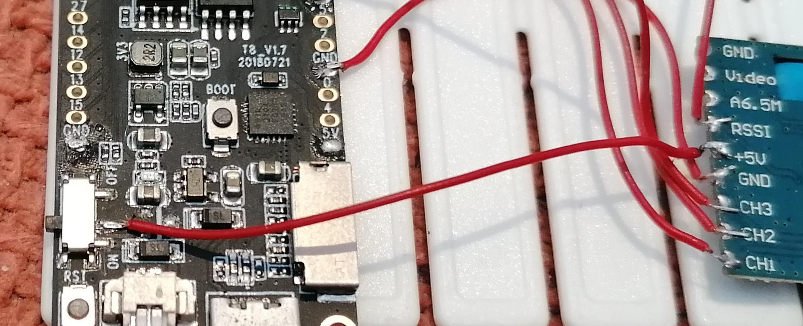
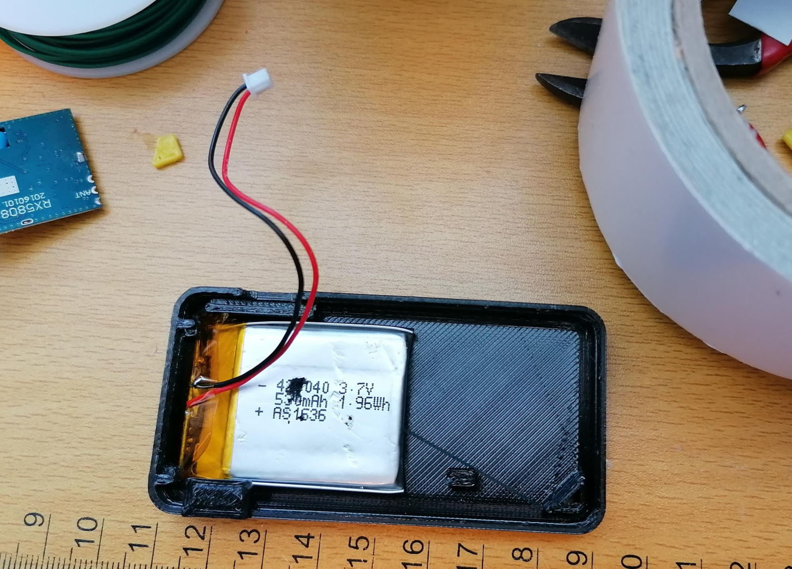
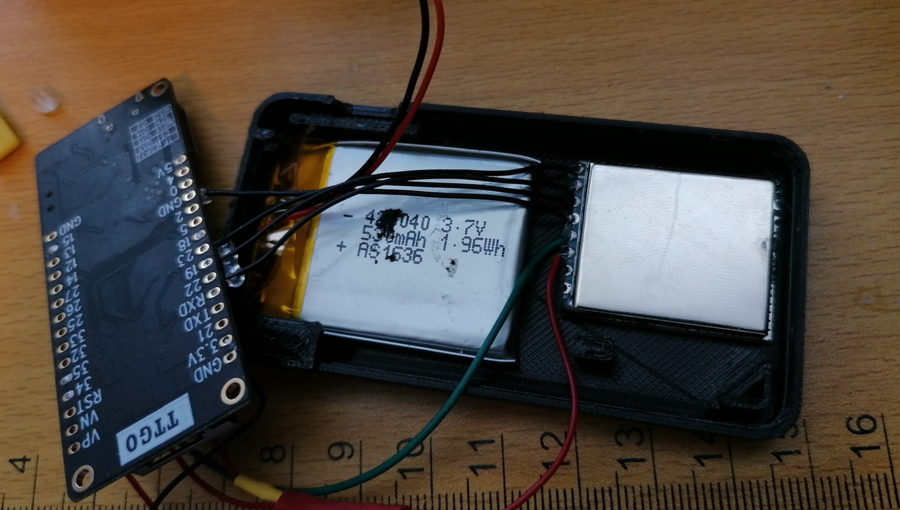
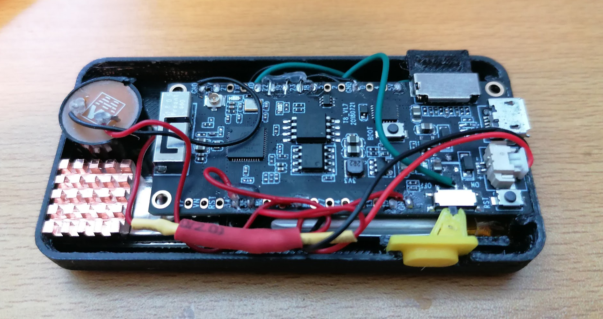
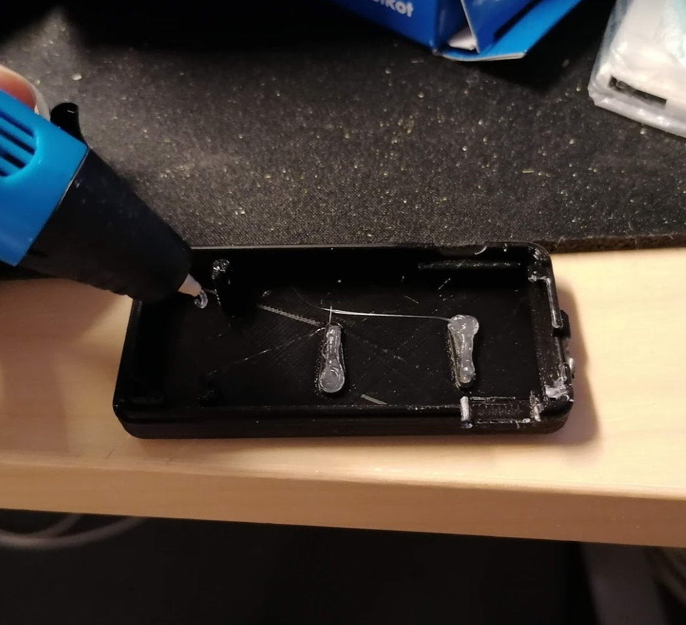

# ESP32 based timer #

## Parts ##
* ESP32 TTGO T8 https://s.click.aliexpress.com/e/_d6sfNUb Reference: https://github.com/LilyGO/TTGO-T8-ESP32
* RX5808 https://s.click.aliexpress.com/e/_dUaM1rh
* 2x 4.7K resistors
* Small battery (optional) i.e.: https://aliexpi.com/ZSsn
* Buzzer (optional) https://s.click.aliexpress.com/e/_d75AAWT

## Pinout ##
| ESP32 T8 | RX5880 | Comments |
| :------------- |:-------------| :-----|
| 34 | RSSI | Via resistor divider |
| GND | GND | |
| 19 | CH1 | |
| 22 | CH2 | |
| 23 | CH3 | |
| Switch | +5V | Directly to the middle leg of the ON/OFF switch |

* The optional **Buzzer** goes to pin 25 and GND

### Switch 

VCC in the ESP32 is not powered when the board is running of the battery, so we need to tap directly to the middle pin of the switch as shown here:

### Resistor divider

    RSSI ------ 4.7K ------ Pin 34 ------ 4.7K ------ GND

RSSI from the RX5880 may oscilate between 5V (if powered by USB) and 4.3V to 3.5V (if powered by the battery). The RX5880 +5V pin is tolerant of that range https://www.foxtechfpv.com/product/5.8G%20modules/rx5808/RX5808-Spec-V1.pdf however, the ESP32 is not so this resistor divider is just to half that voltage. 

The ESP32 uses pin 35 internally to measure that voltage reference and provide a right RSSI value.

## Case
The case consist of 4 parts. Two pieces of the shell and two pieces for the ON/OFF slider switch. You will need super glue and double sided tape.

On the bottom part, place the battery with tape

Place the RX next to it. You can place a heatsink and the buzzer on top of the RX.

Notice that the two pieces of the switch slider are glued in a way that interacts with the physical switch of the ESP32. Place both in place with tweezers and drop a small dab of super glue between the plastic parts. Wait and remove it from the assembly and add more glue from the opposite direction now.

Everything should look like this. 

You need to fill the led indicator slots. In the image a 3d pen is used to inyect translucent PLA in place but a hot melt glue gun would also work.

## Firmware ##

1. Add ESP32 boards to Arduino IDE adding the following line in preferences: https://dl.espressif.com/dl/package_esp32_index.json
2. Compile and upload the code from this repository using: ESP32 Wrover Module
